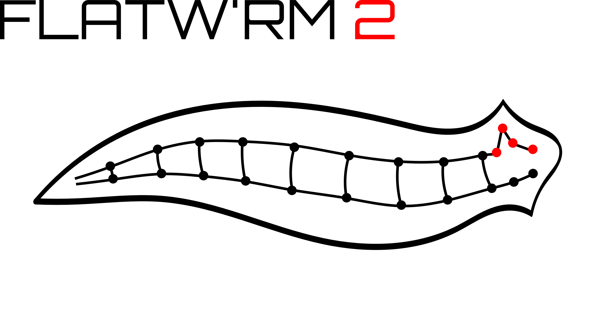
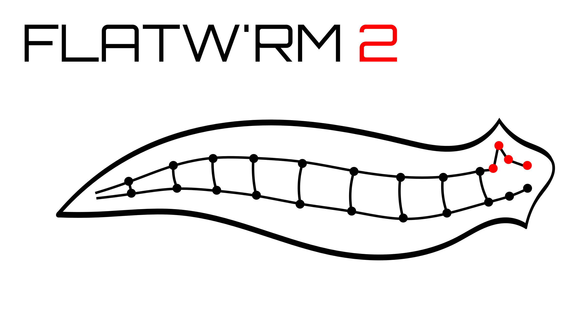

[](https://github.com/vidakris/flatwrm2/tree/master/examples)
[](https://colab.research.google.com/github/vidakris/flatwrm2/blob/master/examples/example.ipynb)


# FLATW'RM2

FLATW'RM2 is a deep learning code that was developed to detect flares in light curves obtained by space observatories (like Kepler or TESS). For more details, see the paper on <a href="https://arxiv.org/abs/2105.11485">arXiv</a>.

The code was developed using <a href="https://keras.io">Keras</a>: a deep learning API built on Tensorflow.

## Installation

The code depends on the following packages:
* tensorflow
* numpy
* scipy
* numba
* pandas
* astropy
* tqdm (optional, for progress bars)
* matplotlib (for testing)

Additionally, for `ocelot-gym.py`, if you want to create your own artificial training files for any reason, you will need `pyMacula` and the analog flare model for injection from Davenport (2016ApJ...829...23D) in the `aflare.py` file.

To install the code, use
```bash
git clone https://github.com/vidakris/flatwrm2
cd flatwrm2
python setup.py install 
```

## Usage

To use the network with the current weight file and a batch size of 16 on GPU 2, use:
`flatwrm2 -m LSTM_weights_keplerSC.h5 -b 16 --gpu=2 light_curve.dat`
For general help on usage, try:
`flatwrm2 --help`.

Alternatively, you can use `flatwrm2` as a module from jupyter-notebook, check the `example.ipynb` notebook in the examples.

The attached `.h5` weight files are the results from training the network on artificial data and Kepler light curves, `LSTM_weights_keplerSC_only.h5` was trained on Kepler light curves only. The result of a K-fold training is also available for determining uncertainty in the prediction.

## Retraining the network 

For retraining the network, you can use the `ocelot-gym` code to generate artificial spotted, flaring light curves, but these shouldn't be the only training data for the network, make sure there is enough real light curves with the flares flagged in it.

Once you have your training data, you can use the `flatwrm2-training.ipynb` notebook to train your network, either from scratch, or starting from one of the weight files. The runtime of the training is in the order of 5-10 hours on a single GPU.

## Docker image

FLATW'RM2 is available as a docker image, see https://hub.docker.com/r/vidakris/flatwrm2 for details. The image supports both CPU-only, and GPU-based calculations based on nvidia-docker.

<!---->
<p align="center">
  <br><br>

</p>
